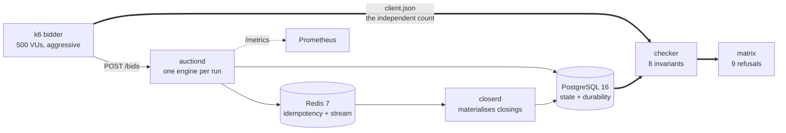

# bid-storm

**Three concurrency strategies. One database row. Five hundred clients fighting over it.**


This is not an auction project. It is a project about **write contention**, using an auction as the workload — because an auction has the property almost no CRUD system has: a thousand people writing to the *same row* in the same second, where every write must read the latest state before deciding, and none may be lost or applied twice.

> **Which concurrency strategy holds throughput when N clients fight over one row, and exactly where does each one break?**

The deliverable was never "a working auction". It is the number below, and the machinery that makes it believable.

---

## The result

Nine cells, three engines × three contention levels, 500 concurrent bidders, PostgreSQL pool fixed at 25.

```text
aceitos/s por contenção · ramp · immediate

                     1 leilão    10 leilões  1000 leilões
Otimista                 6.61        101.65       1397.80
Pessimista              35.84        257.46       1381.24
Single-writer           46.21        319.87       1651.43
```

**The optimistic strategy — the one every tutorial reaches for — is 7× slower than a lock at the exact point where it matters most.**

| Contention | Optimistic | Single-writer | Penalty |
| --- | --- | --- | --- |
| 1 auction (total) | 6.61/s · p95 201ms · **152 attempts per accept** | 46.21/s · p95 86ms | **7.0×** |
| 10 auctions | 101.65/s | 319.87/s | 3.1× |
| 1000 auctions (almost none) | 1397.80/s | 1651.43/s | 1.2× |

The penalty scales with contention, and it comes from exactly where the hypothesis said it would: at one auction the optimistic engine burned **997 conflicts per second** and needed 152 tries to land one bid. Single-writer never conflicts, because there is nothing to conflict with — one goroutine owns the row, so serialisation is structural rather than negotiated.

**And the instrument was working against this conclusion, not for it.** In the cells where the optimistic engine lost, the load generator sat at 43–55% of its CPU limit. In the cells that beat it, the generator was pinned at ~105%. The loser measured with room to spare; the winners measured at the ceiling. `35.84` and `46.21` are **floors** — the real gap is wider, never narrower.

---

## Why you can believe the number

Anyone can print a benchmark. The interesting half of this repository is the part that tries to **stop** the benchmark from being published.

### The harness refuses its own results

The aggregator reads 37 directories and blocks publication on **nine** conditions: a missing cell, a directory the plan never asked for, a cell that was never verified, a chaos cell mixed with healthy ones, cells built from different commits, a dirty tree, a cell whose recorded engine disagrees with its own directory name, a pool size that drifted, a zero-accept cell.

Five of those are statements the per-cell verifier is *structurally unable* to make — it checks one cell at a time against a freshly reset database, and cannot know what the other 36 did. The nastiest case it catches: **a perfectly green cell that ran against the wrong engine.** A plausible, false row that leaves no trace anywhere else.

All refusals are reported at once. A matrix with three problems that reports one per run costs three runs to find the third, and each of those runs costs hours.

### Eight invariants, after every cell

Dense bid sequences with no gaps · strictly increasing amounts · a recorded winner matching the highest accepted bid · no bid after closing · **durability against the client's own count** · idempotency keys present and unique · coherent closing · and whether the cell is worth reading at all.

A violated invariant stops everything. So does a cell that could not be checked — and the two exit with **different codes**, because one is a finding about the engine and the other is the absence of a finding.

### No published number comes from the process under test

The claim *"every bid that got a 201 is in the database"* depends on a count that only exists client-side. The load generator exports it; the verifier consumes it.

Asking the server's own metrics would be the server grading itself: if the handler lies, the metric lies with it and the invariant passes green. Same rule everywhere — the aggregator reads the environment record, the client record and the verifier's report, and nothing else.

### The control cell

The first cell is run **again as the last one**, hours later. If the machine drifted, the two disagree.

This run: `6.61` vs `6.47` accepts/s — **2.1% divergence**. Below the 10% this project treats as indistinguishable from noise, which is what licenses the comparison above. Past 25% the whole matrix is refused, because a gap that large means the distance between two curves could be explained entirely by the order they ran in.

The control block is published even when it passes. A control that only appears when it fails is a control the reader cannot tell ran.

### Four method invariants

Three strategies are only comparable if everything else is identical:

| Rule | What breaks without it |
| --- | --- |
| `201` means **durable** in all three engines | Single-writer wins by promising less, not by being better |
| The client behaves **identically** against all three | The engines get different loads and "accepts/s" compares nothing |
| Pool, CPU and memory **fixed and equal** | You measure your configuration and call it a result |
| Every cell starts from the **same state** | The last strategy in the list looks worst by ordering alone |

---

## The three strategies

| | Mechanism | Cost per bid | Measured behaviour |
| --- | --- | --- | --- |
| **Optimistic** | `UPDATE ... WHERE version = $n`, `409` + client retry | 1 round-trip + N retries | **Collapses under contention.** 997 conflicts/s, 152 attempts per accept, p95 2.4× worse |
| **Pessimistic** | `SELECT ... FOR UPDATE` inside the transaction | 1 round-trip + lock wait | Stable, but holds a pool connection — concurrency is capped by pool size |
| **Single-writer** | One goroutine owns each auction; bids arrive by channel, commit in batches | 1 channel send + 1 batched commit | **Fastest at every level measured.** No conflict, no retry, no lock |

They sit behind one interface, so swapping engines changes an environment variable and nothing else. Before any cell is measured, the harness **asks the running process which engine it actually is** — via its own metric labels, not the config file — because a cell run against the wrong engine produces a plausible, false row and leaves no trace.

---

## The bidder is aggressive, on purpose

This is the decision that determines whether the graph measures anything at all.

If each client sent a fixed amount, everyone would be outbid after round one and give up. Conflicts would collapse toward zero and the optimistic engine would look *optimal* — proving the opposite of the hypothesis by accident of instrumentation.

So the client always wants to win: it re-aims on top of whatever state the rejection returned. Every rejection becomes genuine contention, which is the variable under test. It gives up after a bounded number of attempts or a deadline — and that give-up rate is a headline number rather than a footnote, because under high contention it *is* the collapse made visible.

It also **injects duplicate requests into every cell**, on purpose: retries that cross a network do happen, and the invariant that catches a double-applied bid is worth nothing if nothing ever tries to double-apply one. The verifier proves each duplicate was replayed from its idempotency key rather than accepted twice.

---

## Breaking it on purpose

Correctness under load is not the same claim as correctness under load *while things break*. A separate stage, from outside the processes, while real traffic runs:

**kills the closing worker mid-processing** · **kills the API process** · **freezes Redis** · **saturates the connection pool**

Four injections, five cells: the closing-worker kill runs twice, against two different engines, because the engine that decides the winner changes what a half-processed closing can leave behind.

Exactly two verdicts loosen under injected failure: the error rate stops failing the cell — under an injection the errors *are* the injection — and an injection that never landed **starts** failing it, because a chaos cell that broke nothing is the worst result available: it looks like proof and is not.

Chaos cells are marked in their own artefacts and can never enter the matrix. A cell with a process killed inside it measured a different system.

---

## Architecture



Everything runs in Compose with **fixed CPU and memory limits**, read back from `docker inspect` rather than trusted from the YAML — a limit that Compose silently ignored is not a limit, and the record of a published number cannot lie about it.

---

## Running it

```bash
make up          # postgres, redis, auctiond, closerd, prometheus, grafana
make bench       # one measured cell, end to end
make chaos       # the four injections, five cells
make check       # the eight invariants against the last cell

# the nine cells of the graph, ~30 min
PLAN=slice CELL_BUDGET=240 bench/run-matrix.sh

# the full 36 plus the control, ~4h30
bench/run-matrix.sh
```

The matrix loop is invoked directly and **never through `make`**: GNU make collapses every recipe failure into its own exit code 2, and this loop keeps three apart — a violated invariant (1), a cell it could not verify (2), a breached threshold (99). That difference is exactly the information whoever resumes a four-hour run needs.

Interrupted runs resume with `MATRIX=<id> RESUME=1`, which re-measures only what is not already green — and refuses to resume across a commit boundary, because two cells built from different code are not one matrix.

---

## What this does not claim

The measurement plan is 36 cells: three strategies × three contention levels × two load scenarios × two retry policies. **Nine of them are published here** — the slice that draws the graph above.

1. **The `jitter` axis was not run.** The strongest criticism this project can receive is *"your optimistic engine collapsed because you retried without backoff"*. That criticism is valid, the axis exists in the harness, and it has not been measured yet — so nothing above rules out backoff rescuing the optimistic engine.
2. **The one-auction column runs above 90% exhaustion** in all three engines: nine of every ten logical bids give up before being accepted. That column measures the bidder's retry budget as much as it measures the engine.
3. **The thousand-auction row is the generator's ceiling.** All three engines pinned k6 at ~105% and landed within 15% of each other. The apparent crossing there is 1.2% — smaller than the control's own 2.1% divergence, i.e. inside the noise. **No crossing point is established by this data.**

Stating this is not a disclaimer. It is the same rule as everything above: a result announced as partial is a result, and the same result announced as complete is not.

---

## Documentation

| | |
| --- | --- |
| [`docs/projeto/`](docs/projeto/) | The system: how it is and why. Moves slowly |
| [`docs/decisoes/`](docs/decisoes/) | The record of *why*, one file per stage. Only grows |
| [`docs/specs/`](docs/specs/) | What was built, stage by stage, with measurable checkpoints |
| [`docs/projeto/benchmark.md`](docs/projeto/benchmark.md) | The full results table, per-cell warnings and artefact paths |

Measurement artefacts are deliberately not versioned. What becomes durable is the *read* result — the table, the graph, and the text explaining them — reviewed as prose rather than as shell.
