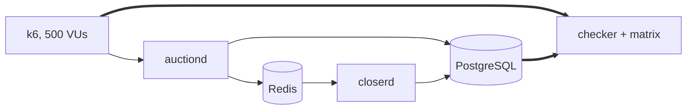

# bid-storm

**Three concurrency strategies. One database row. 500 clients fighting over it.**

<p align="left">
  <a href="https://skillicons.dev">
    
  </a>
</p>

## Apresentação

An auction is the worst concurrency case in ordinary software: everyone writes to the same row, every write has to read the latest state before deciding, and nothing may be lost or applied twice.

Three strategies answer that problem. This repo runs all three under identical load, on fixed hardware limits, and publishes the graph.

| | Mechanism | Cost per bid |
| --- | --- | --- |
| **Optimistic** | `UPDATE ... WHERE version = $n`, `409` and the client retries | 1 round trip, plus N retries |
| **Pessimistic** | `SELECT ... FOR UPDATE` inside the transaction | 1 round trip, plus lock wait |
| **Single writer** | One goroutine owns each auction, bids arrive by channel | 1 channel send, plus 1 batched commit |



## Resultados

```text
aceitos/s por contenção · ramp · immediate

                     1 leilão    10 leilões  1000 leilões
Otimista                 6.61        101.65       1397.80
Pessimista              35.84        257.46       1381.24
Single-writer           46.21        319.87       1651.43
```

| Contention | Optimistic | Single writer | Gap |
| --- | --- | --- | --- |
| 1 auction | 6.61/s, p95 201ms, **152 attempts per accept** | 46.21/s, p95 86ms | **7.0x** |
| 10 auctions | 101.65/s | 319.87/s | 3.1x |
| 1000 auctions | 1397.80/s | 1651.43/s | 1.2x |

**Optimistic locking, the default answer in every tutorial, is 7x slower than a lock at the exact point where it matters.** It burned 997 conflicts per second and needed 152 tries to land a single bid. The single writer never conflicts, because one goroutine owns the row and serialisation becomes structural.

The instrument was working against that conclusion, not for it. Where the optimistic engine lost, the load generator idled at 43% of its CPU limit. In the cells that beat it, the generator was pinned at 105%. The winners measured at the ceiling, so those numbers are floors.

### Why the number holds up

- **The harness refuses its own results.** Nine conditions block publication: a missing cell, a foreign directory, an unverified cell, mixed commits, a dirty tree, a pool size that drifted, a cell whose recorded engine disagrees with its own directory name. That last one catches a perfectly green cell that ran against the wrong engine.
- **Eight invariants after every cell**, durability among them, checked against the client's own count.
- **No published number comes from the process under test.** Asking the server for the metric it is being judged on is the server grading itself.
- **The first cell runs again as the last one.** This run diverged 2.1%, so execution order does not explain the distance between the curves.
- **Four failure injections** kill the closing worker, kill the API, freeze Redis and saturate the pool, while real load runs.

```bash
make up                                            # the whole stack
make bench                                         # one measured cell
make chaos                                         # the failure injections
PLAN=slice CELL_BUDGET=240 bench/run-matrix.sh     # the nine cells above, ~30min
```

## Conclusão

The bet paid off. The single writer wins at every level measured, and the cost of optimistic locking scales with contention: 7x, then 3.1x, then 1.2x as the fight for one row dissolves into a thousand.

Two things this does not claim. Nine of the 36 planned cells ran, so the `jitter` axis (retry with backoff) is still unmeasured and the strongest counter argument to the headline stands. And the 1000 auction row pinned the load generator, so its 1.2% spread sits inside the control's own noise: no crossing point is established there.

A result announced as partial is a result. The same result announced as complete is not.

Full table and per cell warnings in [docs/projeto/benchmark.md](docs/projeto/benchmark.md). Design decisions, one file per stage, in [docs/decisoes/](docs/decisoes/).
